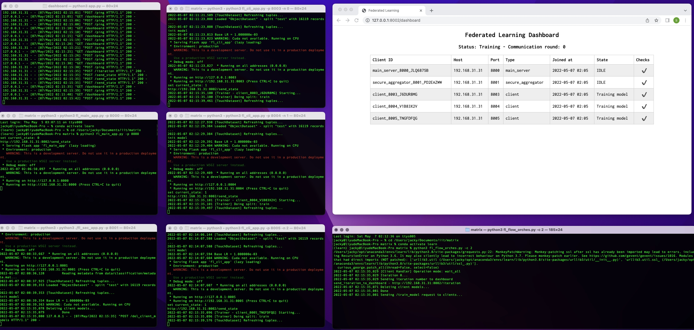

### Matrix (Federated Learning)

### Operating Manual

#### Application Dashboard
```shell
cd dashboard 
python3 app.py
```
http://127.0.0.1:8002/dashboard

#### Main APP Server(fl_main_app) 
```shell
python3 fl_main_app.py -p 8000 
```

#### Secure Aggregator(fl_sec_app)
```shell
python3 ./fl_sec_app.py -p 8001
```
#### Client(fl_cli_app)
```shell
 python3 fl_cli_app.py -p 8003 -n 0
 python3 fl_cli_app.py -p 8004 -n 1
 python3 fl_cli_app.py -p 8003 -n 2
 ...
 for the configuration of the number of clients, 
 see hosts.yml
```

##### flow Orchestration Simulator(fl_flow_orches)
```shell
python3 fl_flow_orches.py -c 2
```

##### Model implementation code
reference https://github.com/Erkil1452/touch

##### Functional screenshot



---

### 操作手册

#### 运行看板(dashboard) 
```shell
cd dashboard 
python3 app.py
```
http://127.0.0.1:8002/dashboard

#### 运行总服务端(fl_main_app) 
```shell
python3 fl_main_app.py -p 8000 
```

#### 运行安全聚合器(fl_sec_app)
```shell
python3 ./fl_sec_app.py -p 8001
```
#### 运行客户端(fl_cli_app)
```shell
 python3 fl_cli_app.py -p 8003 -n 0
 python3 fl_cli_app.py -p 8004 -n 1
 python3 fl_cli_app.py -p 8003 -n 2
 ...
 客户端数量配置见 hosts.yml
```

##### 模拟任务编排(fl_flow_orches)
```shell
python3 fl_flow_orches.py -c 2
```

##### 模型实现代码
参考 https://github.com/Erkil1452/touch

##### 功能展示

